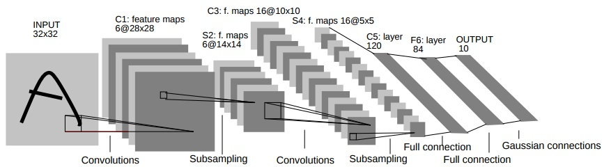

# Computer Vision - Homework 3
蒋骁翀，22021037，计算机科学与技术学院，浙江大学

## 如何运行
- Task 1:
```bash
python lenet5.py -train -dataset=mymnist
python lenet5.py -dataset=mymnist
```
- Task 2:
```bash
python train.py -net=resnet101 -dataset=mycifar10 -batch=128
python test.py -net=resnet101 -weights=weights/resnet101-mycifar10.pth -dataset=mycifar10 -batch=128
```

## Task 1: LeNet-5网络与自定义MNIST数据集
### LeNet-5
本次实验我们采用LeNet-5网络结构。LeNet-5是Yann LeCun在1998年设计的用于手写数字识别的卷积神经网络，是早期卷积神经网络中最有代表性的实验系统之一。LenNet-5共有7层（不包括输入层），每层都包含不同数量的训练参数。LeNet-5模型的结构如下图所示：

各层参数如下：
- 输入层
	原始图片的大小是28×28，因此我们首先要对数据进行预处理。我们在原图片的四周填充两行/列零向量，使之变为32×32的大小。这个过程可以使用如下代码实现。

- 卷积层（C1）
    - 输入图片：32×32
    - 卷积核大小：5×5
    - 卷积核种类：6
    - 输出大小：28×28
    - 神经元数量：28×28×6
    - 可训练参数：（5×5 + 1）×6（每个滤波器5×5 = 25个unit参数和一个bias参数，一共6个滤波器）
    - 连接数：（5×5+1）× 6 × 28 × 28
- 池化层（S2）
    - 输入：28×28
    - 采样区域：2×2
    - 采样方式：4个输入相加，乘以一个可训练参数，再加上一个可训练偏置
    - 采样种类：6
    - 输出大小：14×14（28/2）
    - 神经元数量：14×14×6
    - 可训练参数：2×6（和的权+偏置）
    - 连接数：（2×2 + 1）×6×14×14
    - S2中每个特征图的大小是C1中特征图大小的1/4

- 卷积层（C3）
    - 输入：S2中所有6个或者几个特征map组合
    - 卷积核大小：5×5
    - 卷积核种类：16
    - 输出大小：10×10
    - C3中的每个特征map是连接到S2中的所有6个或者几个特征map的，表示本层的特征map是上一层提取到的特征map的不同组合
    - C3的前6个特征图以S2中3个相邻的特征图子集为输入，接下来6个特征图以S2中4个相邻特征图子集为输入，然后的3个以不相邻的4个特征图子集为输入，最后一个将S2中所有特征图为输入（如下图所示）
    - 可训练参数：6×（3×25+1）+6×（4×25+1）+3×（4×25+1）+（25×6+1）=1516
    - 连接数：10×10×1516=151600

- 池化层（S4）
    - 输入：10×10
    - 采样区域：2×2
    - 采样方式：4个输入相加，乘以一个可训练参数，再加上一个可训练偏置
    - 采样种类：16
    - 输出大小：5×5（10/2）
    - 神经元数量：5×5×16=400
    - 可训练参数：2×16=32（和的权+偏置）
    - 连接数：16×（2×2+1）×5×5=2000
    - S4中每个特征图的大小是C3中特征图大小的1/4

- 卷积层（C5）
    - 输入：5×5
    - 卷积核大小：5×5
    - 卷积核种类：120
    - 输出大小：1×120
    - 由于S4层的16个图的大小为5×5，与卷积核的大小相同，所以卷积后形成的图的大小为1×1。这里形成120个卷积结果。
    - 每个都与上一层的16个图相连。所以共有(5×5×16 + 1)×120 = 48120个参数，同样有48120个连接。

- 全连接层（F6）
    - 输入：1×120
    - 输出：1×84
    - 节点数：84，对应于一个7×12的比特图
    - 计算方式：计算输入向量和权重向量之间的点积，再加上一个偏置
    - 可训练参数:84×(120 + 1) = 10164


- 全连接层（F7）
    - 输入：1×84
    - 输出：1×10
    - 节点数：10，分别代表数字0到9，如果节点i的输出值为0，则网络识别的结果是数字i
    - 计算方式：计算输入向量和权重向量之间的点积，再加上一个偏置
    - 可训练参数:84×10 = 840

具体的PyTorch代码实现为：

```python
class LeNet5(nn.Module):

    def __init__(self):
        super(LeNet5, self).__init__()
        self.conv1 = nn.Conv2d(1, 6, 5)
        self.conv2 = nn.Conv2d(6, 16, 5)
        self.fc1 = nn.Linear(16 * 5 * 5, 120)
        self.fc2 = nn.Linear(120, 84)
        self.fc3 = nn.Linear(84, 10)

    def forward(self, x):
        x = F.max_pool2d(F.relu(self.conv1(x)), (2, 2))
        x = F.max_pool2d(F.relu(self.conv2(x)), (2, 2))
        x = x.view(-1, self.num_flat_features(x))
        x = F.relu(self.fc1(x))
        x = F.relu(self.fc2(x))
        x = self.fc3(x)
        return x

    def num_flat_features(self, x):
        size = x.size()[1:]
        num_features = 1
        for s in size:
            num_features *= s
        return num_features
```
### 自定义MNIST数据集
本次实验我们利用MNIST手写数字数据集，将其中两个0、1数字，按0的图像旋转90度与1的图像重叠合并形成一个新的“数字”符号，用这个新的符号替换数字0，从而构建完成一个包括新的数据集MyMNIST。新的数字如下图：


这部分的具体实现在dataset.py中，我们通过继承torch.utils.data中的Dataset类，并使用一个预处理函数完成上述操作。

具体的Python代码如下

```python
def preprocess():
    root = 'data/mymnist/'

    train_images_path = 'data/mnist/MNIST/raw/train-images.idx3-ubyte'
    train_labels_path = 'data/mnist/MNIST/raw/train-labels.idx1-ubyte'
 
    test_images_path = 'data/mnist/MNIST/raw/t10k-images.idx3-ubyte'
    test_labels_path = 'data/mnist/MNIST/raw/t10k-labels.idx1-ubyte'

    train_images = load_mnist_images(train_images_path)
    train_labels = load_mnist_labels(train_labels_path)

    test_images = load_mnist_images(test_images_path)
    test_labels = load_mnist_labels(test_labels_path)

    indices_zero = np.where(train_labels == 0)[0]
    indices_one = np.where(train_labels == 1)[0]
    for i in indices_zero:
        j = np.random.choice(indices_one)
        train_images[i] = np.maximum(np.rot90(train_images[i]), train_images[j])
    i = np.random.choice(indices_zero)
    cv2.imwrite('./images/train_zero.jpg', train_images[i])
    
    
    indices_zero = np.where(test_labels == 0)[0]
    indices_one = np.where(test_labels == 1)[0]
    for i in indices_zero:
        j = np.random.choice(indices_one)
        test_images[i] = np.maximum(np.rot90(test_images[i]), test_images[j])
    i = np.random.choice(indices_zero)
    cv2.imwrite('./images/test_zero.jpg', test_images[i])

    torch.save((train_images, train_labels), os.path.join(root, 'train.pt'))
    torch.save((test_images, test_labels), os.path.join(root, 'test.pt'))
```

### 结果

我们在一台配备2080Ti上的机器上训练该模型，并与原有的MNIST进行准确度比较。LeNet-5在MNIST上取得了98.5%的准确率，在自定义的MyMNIST上取得了97.6%的准确度。


## Task 2: 自定义CIFAR-10数据集并使用分类网络完成图像分类任务
原有的CIFAR-10数据集有60000张32x32的RGB彩色图片，共10个类，每个类6000张。类别如下：
- airplane										
- automobile										
- bird										
- cat										
- deer										
- dog										
- frog										
- horse										
- ship										
- truck

我们向其中添加了一个CIFAR-100中属于People的Superclass。处理完成后，我们的数据集共有63000张图片，其中，训练集52500张，测试集10500张。具体实现方法如下：

```python
class MyCIFAR10(Dataset):

    train_list_1 = [
        ['data_batch_1', 'c99cafc152244af753f735de768cd75f'],
        ['data_batch_2', 'd4bba439e000b95fd0a9bffe97cbabec'],
        ['data_batch_3', '54ebc095f3ab1f0389bbae665268c751'],
        ['data_batch_4', '634d18415352ddfa80567beed471001a'],
        ['data_batch_5', '482c414d41f54cd18b22e5b47cb7c3cb'],
    ]
    test_list_1 = [
        ['test_batch', '40351d587109b95175f43aff81a1287e'],
    ]

    train_list_2 = [
        ['train', '16019d7e3df5f24257cddd939b257f8d'],
    ]

    test_list_2 = [
        ['test', 'f0ef6b0ae62326f3e7ffdfab6717acfc'],
    ]

    def __init__(
            self,
            root: str,
            train: bool = True,
            transform: Optional[Callable] = None,
            target_transform: Optional[Callable] = None,
    ) -> None:

        self.root = root
        self.train = train

        if self.train:
            downloaded_list_1 = self.train_list_1
            downloaded_list_2 = self.train_list_2
        else:
            downloaded_list_1 = self.test_list_1
            downloaded_list_2 = self.test_list_2

        self.data: Any = []
        self.targets = []

        # now load the picked numpy arrays
        for file_name, checksum in downloaded_list_1:
            file_path = os.path.join(self.root, file_name)
            with open(file_path, 'rb') as f:
                entry = pickle.load(f, encoding='latin1')
                self.data.append(entry['data'])
                if 'labels' in entry:
                    self.targets.extend(entry['labels'])
                else:
                    self.targets.extend(entry['fine_labels'])

        for file_name, checksum in downloaded_list_2:
            file_path = os.path.join(self.root, file_name)
            with open(file_path, 'rb') as f:
                entry = pickle.load(f, encoding='latin1')
                labels = np.asarray(entry['coarse_labels'])
                images = entry['data']
                people_indices = np.where(labels == 14)[0]
                for i in people_indices:
                    self.data.append(images[i])
                    self.targets.append(10)
        
        self.data = np.vstack(self.data).reshape(-1, 3, 32, 32)
        self.data = self.data.transpose((0, 2, 3, 1))  # convert to HWC
```

在分类网络的选择上，我们选择了ResNet-101网络。具体实现如下：

```python
class BasicBlock(nn.Module):
    """Basic Block for resnet 18 and resnet 34

    """

    #BasicBlock and BottleNeck block
    #have different output size
    #we use class attribute expansion
    #to distinct
    expansion = 1

    def __init__(self, in_channels, out_channels, stride=1):
        super().__init__()

        #residual function
        self.residual_function = nn.Sequential(
            nn.Conv2d(in_channels, out_channels, kernel_size=3, stride=stride, padding=1, bias=False),
            nn.BatchNorm2d(out_channels),
            nn.ReLU(inplace=True),
            nn.Conv2d(out_channels, out_channels * BasicBlock.expansion, kernel_size=3, padding=1, bias=False),
            nn.BatchNorm2d(out_channels * BasicBlock.expansion)
        )

        #shortcut
        self.shortcut = nn.Sequential()

        #the shortcut output dimension is not the same with residual function
        #use 1*1 convolution to match the dimension
        if stride != 1 or in_channels != BasicBlock.expansion * out_channels:
            self.shortcut = nn.Sequential(
                nn.Conv2d(in_channels, out_channels * BasicBlock.expansion, kernel_size=1, stride=stride, bias=False),
                nn.BatchNorm2d(out_channels * BasicBlock.expansion)
            )

    def forward(self, x):
        return nn.ReLU(inplace=True)(self.residual_function(x) + self.shortcut(x))

class BottleNeck(nn.Module):
    """Residual block for resnet over 50 layers

    """
    expansion = 4
    def __init__(self, in_channels, out_channels, stride=1):
        super().__init__()
        self.residual_function = nn.Sequential(
            nn.Conv2d(in_channels, out_channels, kernel_size=1, bias=False),
            nn.BatchNorm2d(out_channels),
            nn.ReLU(inplace=True),
            nn.Conv2d(out_channels, out_channels, stride=stride, kernel_size=3, padding=1, bias=False),
            nn.BatchNorm2d(out_channels),
            nn.ReLU(inplace=True),
            nn.Conv2d(out_channels, out_channels * BottleNeck.expansion, kernel_size=1, bias=False),
            nn.BatchNorm2d(out_channels * BottleNeck.expansion),
        )

        self.shortcut = nn.Sequential()

        if stride != 1 or in_channels != out_channels * BottleNeck.expansion:
            self.shortcut = nn.Sequential(
                nn.Conv2d(in_channels, out_channels * BottleNeck.expansion, stride=stride, kernel_size=1, bias=False),
                nn.BatchNorm2d(out_channels * BottleNeck.expansion)
            )

    def forward(self, x):
        return nn.ReLU(inplace=True)(self.residual_function(x) + self.shortcut(x))

class ResNet(nn.Module):

    def __init__(self, block, num_block, num_class=100):
        super().__init__()

        self.in_channels = 64

        self.conv1 = nn.Sequential(
            nn.Conv2d(3, 64, kernel_size=3, padding=1, bias=False),
            nn.BatchNorm2d(64),
            nn.ReLU(inplace=True))
        #we use a different inputsize than the original paper
        #so conv2_x's stride is 1
        self.conv2_x = self._make_layer(block, 64, num_block[0], 1)
        self.conv3_x = self._make_layer(block, 128, num_block[1], 2)
        self.conv4_x = self._make_layer(block, 256, num_block[2], 2)
        self.conv5_x = self._make_layer(block, 512, num_block[3], 2)
        self.avg_pool = nn.AdaptiveAvgPool2d((1, 1))
        self.fc = nn.Linear(512 * block.expansion, num_class)

    def _make_layer(self, block, out_channels, num_blocks, stride):
        """make resnet layers(by layer i didnt mean this 'layer' was the
        same as a neuron netowork layer, ex. conv layer), one layer may
        contain more than one residual block

        Args:
            block: block type, basic block or bottle neck block
            out_channels: output depth channel number of this layer
            num_blocks: how many blocks per layer
            stride: the stride of the first block of this layer

        Return:
            return a resnet layer
        """

        # we have num_block blocks per layer, the first block
        # could be 1 or 2, other blocks would always be 1
        strides = [stride] + [1] * (num_blocks - 1)
        layers = []
        for stride in strides:
            layers.append(block(self.in_channels, out_channels, stride))
            self.in_channels = out_channels * block.expansion

        return nn.Sequential(*layers)

    def forward(self, x):
        output = self.conv1(x)
        output = self.conv2_x(output)
        output = self.conv3_x(output)
        output = self.conv4_x(output)
        output = self.conv5_x(output)
        output = self.avg_pool(output)
        output = output.view(output.size(0), -1)
        output = self.fc(output)

        return output

def resnet18():
    """ return a ResNet 18 object
    """
    return ResNet(BasicBlock, [2, 2, 2, 2])

def resnet34():
    """ return a ResNet 34 object
    """
    return ResNet(BasicBlock, [3, 4, 6, 3])

def resnet50():
    """ return a ResNet 50 object
    """
    return ResNet(BottleNeck, [3, 4, 6, 3])

def resnet101(num_class):
    """ return a ResNet 101 object
    """
    return ResNet(BottleNeck, [3, 4, 23, 3], num_class=num_class)

def resnet152():
    """ return a ResNet 152 object
    """
    return ResNet(BottleNeck, [3, 8, 36, 3])
```

### 结果

- Resnet-101在CIFAR-10上的Top-1精度为95.33%，Top-5精度为99.86%
- Resnet-101在MyCIFAR-10上的Top-1精度为95.4%，Top-5精度为99.75%